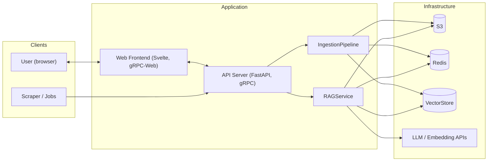

# Demócrata — Political Data Ingestion Engine

## 1. Title and mission

**Project name:** Demócrata (political data ingestion engine)

**Mission:** Help people understand complex political information through clear, accessible explanations while maintaining factual non-partisanship.

**Summary:** The system is a server plus frontend. It provides (1) a political data ingestion pipeline with web upload portals and automated scraping, which cleans data, enriches metadata, embeds content, and prepares it for RAG in blob/vector storage; (2) a RAG query service that accepts natural-language requests, performs top-k embedding search, reasons over retrieved documents, and returns structured UI layouts and components; and (3) a web-based query portal where users ask questions about politics, society, and government and receive dashboards built from the server’s strongly typed insight and analysis payloads.

---

## 2. Scope and goals

### In scope

- File-based RAG on political data (bills, Hansard, political members, etc.).
- Ingestion via web-browser upload portals and automated scraping jobs.
- Cleaning, metadata enrichment, embedding, and RAG-ready storage.
- Natural-language query and structured UI responses: text blocks, charts, timelines, comparisons, data tables, notices/alerts, member profiles, voting breakdowns.
- Cost pass-through: LLM token cost forwarded to the user plus a reasonable profit margin.
- Caching so that similar queries are served from cache where possible without excessive overhead.

### Out of scope

- Real-time streaming of parliamentary or other live feeds.
- Partisan advocacy, recommendations, or persuasive framing. (Note: Factual analysis that reveals asymmetries is not partisan—only advocacy is out of scope.)
- Non–file-based data sources (unless added in a later revision of this spec).

### Non-partisanship

Content and UI framing must remain strictly neutral. There must be no advocacy or partisan framing in explanations, summaries, or layout choices. Clarity and factual presentation are first-order requirements.

**Important clarification:** Non-partisan means *rigorous factual accuracy without advocacy*, not false balance or refusal to present information that might reflect poorly on a party or member.

- **Present facts completely and accurately.** If voting records show 95% of one party voted one way and 5% of another, present that accurately—do not frame it as "mixed views across parties."
- **Avoid advocacy.** Do not tell users what to believe, how to vote, or which positions are "correct." Present information; let users draw conclusions.
- **No false equivalence.** When facts are asymmetric, present them that way. Artificially balancing unequal things is itself a form of bias.
- **Be transparent.** Show sources, methodology, and how information was selected so users can evaluate the presentation themselves.

---

## 3. High-level architecture

The server is stateless and horizontally scalable: add more instances behind a load balancer; correctness does not depend on in-process state. LLM and storage scale via the cloud provider; the application offloads scaling to S3, Redis, and external LLM/embedding APIs.

**Data flow (ingestion):** Upload or scrape → ingestion pipeline → clean & metadata → embed → store blobs in S3, vectors and metadata for top-k search; use Redis where appropriate for cache.

**Data flow (query):** Natural-language request → RAG service → embedding search (top-k) → retrieve documents → LLM reasoning → structured response (layout + components) → frontend renders dashboard.

---

## 4. Component specifications

### 4.1 Political data ingestion pipeline / service

- **Inputs:** Web-browser uploads (via upload portals) and automated scraping jobs.
- **Processing:** Clean input data; assign accurate, useful metadata; run through an embedding model; prepare for RAG (chunking, indexing).
- **Storage:** File/blob data in S3; vector index and metadata for top-k search; Redis for cache where appropriate (e.g. repeated embeddings, session or query caches).
- **Output:** Data ready for RAG (retrievable by embedding search).

### 4.2 RAG query service

- **Input:** Natural-language request (and optionally user/session for costing and caching).
- **Behaviour:** Embedding search (top-k); retrieve documents; LLM analysis/reasoning over documents; produce structured response.
- **Output:** Strongly typed structure describing UI: layout and components (text blocks, charts, timelines, comparisons, data tables, notices/alerts, member_profiles, voting_breakdowns, etc.). Types are defined in proto/schema (gRPC/API contract).
- **Integration:** LangChain for agent/LLM and tooling; protocol defined in protobuf RPCs.

### 4.3 Web query portal (frontend)

- **Role:** Accept natural-language queries about politics, society, and government.
- **Communication:** gRPC-Web to server; server returns strongly typed insight/analysis structures.
- **UI:** Render dashboards from that data: beautiful, simple, and easy to interpret. Clarity and accessibility are first-order requirements.
- **Constraints:** No partisan framing; content and layout must remain neutral.

---

## 5. Tech stack

| Layer        | Technology                                      |
|-------------|--------------------------------------------------|
| Server      | Python, FastAPI, gRPC, Protocol Buffers for RPCs |
| Frontend    | Svelte, gRPC-Web client                          |
| Agent / LLM | LangChain for agent integrations                 |
| Storage     | S3 (blob and large artifacts)                    |
| Cache       | Redis (query/result cache; optional embedding/session caches) |
| Scaling     | Stateless app servers; horizontal scaling; LLM and storage offloaded to cloud |

---

## 6. Architecture principles

- **Repository:** Monorepo; domain-centred structure; inversion of dependencies (domain core has no FastAPI/gRPC imports; adapters depend on domain).
- **Code:** Modular, tidy, loosely coupled; KISS and YAGNI.
- **Server:** Stateless; horizontally scalable; no in-process state required for correctness; shared S3, Redis, and same AI/LLM config across instances.
- **Cost and usage:** Freemium model with pay-as-you-go for heavy users. See [docs/COST_MODEL.md](docs/COST_MODEL.md) for full details.
  - **Free tier:** 10 queries/day (anonymous) or 100 queries/month (registered)
  - **Paid tier:** Prepaid credits (1 credit = $0.01); per-query cost based on actual LLM/embedding usage + 40% margin
  - **Cached queries:** Free for paid users; count against limit for free tier
  - **Philosophy:** Civic accessibility (basic access free) + sustainability (modest maintainer income)

---

## 7. Key interfaces (summary)

### gRPC services

- **Ingestion service:** Upload and scrape triggers; job/upload status. Exact method names and request/response types are defined in `.proto` files.
- **RAG query service:** Natural-language in; structured layout/components out. Proto-defined RPCs; main message types include `RAGResponse`, `Layout`, and the component types listed below.

### Structured response schema (layout / component types)

The RAG service outputs, and the frontend must support, at least these component types:

- Text blocks
- Charts
- Timelines
- Comparisons
- Data tables
- Notices / alerts
- Member profiles (`member_profiles`)
- Voting breakdowns (`voting_breakdowns`)

Full field-level definitions live in the protobuf/schema definitions.

---

## 8. Non-functional requirements

- **Availability / scaling:** The service must support horizontal scaling (add instances behind a load balancer). See [docs/SCALING.md](docs/SCALING.md) for phased roadmap from MVP to high-scale production.
- **Cost:** Freemium + pay-as-you-go model. Free tier for casual civic inquiry; prepaid credits for heavy users. Per-query cost = actual API usage + 40% margin. See [docs/COST_MODEL.md](docs/COST_MODEL.md) for pricing details and revenue projections.
- **Performance:** Similar queries are served from cache where feasible; cache design must minimise overhead (e.g. TTL, key strategy).
- **Security:** Auth for uploads and API keys for automated jobs; no PII in logs. Exact mechanisms are TBD and will be documented when implemented.

---

## 9. Out of scope / future

The following are explicitly out of scope for this spec unless added later:

- Real-time parliamentary or other live feeds.
- Non–file-based data sources.
- Mobile apps.
- Internal admin tooling (unless specified in a future revision).
